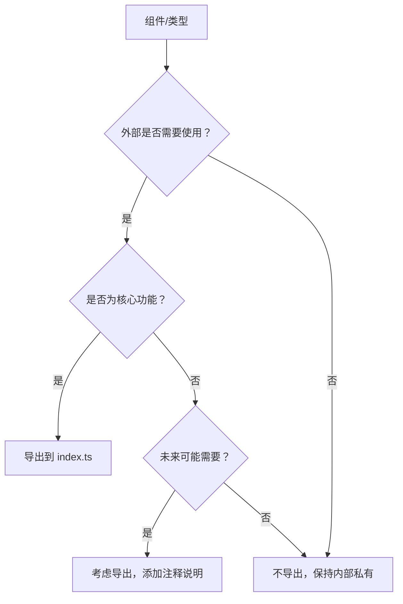

# 老师帮 UniApp 开发规范文档

## 项目概述

本文档旨在为老师帮 UniApp 项目提供统一的开发规范，确保代码质量、视觉一致性和用户体验的标准化。

### 技术栈核心依赖

- **框架**: UniApp (Vue 3 + TypeScript)
- **UI 组件库**: sard-uniapp
- **样式框架**: UnoCSS
- **状态管理**: Pinia
- **网络请求**: Alova
- **分页组件**: z-paging
- **图标库**: Carbon Icons

### 官方文档参考

| 技术 | 官方文档 | 说明 |
|------|----------|------|
| UniApp | https://uniapp.dcloud.net.cn/ | UniApp 官方文档 |
| sard-uniapp | https://sutras.github.io/sard-uniapp-docs/ | UI 组件库文档 |
| Vue 3 | https://cn.vuejs.org/ | Vue 3 组合式 API 文档 |
| TypeScript | https://www.typescriptlang.org/zh/ | TypeScript 官方文档 |
| UnoCSS | https://unocss.dev/ | 原子化 CSS 引擎文档 |
| Pinia | https://pinia.vuejs.org/zh/ | Vue 状态管理库文档 |
| Alova | https://alova.js.org/zh-CN/ | 轻量级请求策略库文档 |
| z-paging | https://z-paging.zxlee.cn/ | 分页组件文档 |
| Carbon Icons | https://carbondesign.com/icons/ | IBM Carbon 设计系统图标库 |

---

## 1. 样式与视觉规范

### 1.1 设计原则优先级

#### 1.1.1 有设计稿情况
- **第一原则**：严格按照设计稿的视觉样式完成实现
- **组件选择**：优先考虑使用 `sard-uniapp` 组件，但不强制替换
- **视觉还原**：如果 `sard-uniapp` 组件无法满足设计稿要求，使用 UnoCSS 原子化类名进行精确还原
- **注释说明**：当偏离组件库时，必须添加注释说明原因

```vue
<!-- 示例：设计稿要求特殊的圆角和阴影效果 -->
<!-- 未使用 sar-button，因为设计稿要求 8rpx 圆角和特定渐变效果 -->
<view class="px-32rpx py-16rpx rounded-8rpx bg-gradient-to-r from-blue-500 to-blue-600 shadow-lg shadow-blue-200/60">
  <text class="text-white font-medium">自定义按钮</text>
</view>
```

#### 1.1.2 无设计稿情况
- **视觉风格**：严格遵循**扁平化设计（Flat Design）**风格
- **组件优先**：优先使用 `sard-uniapp` 组件库
- **风格统一**：所有自定义样式必须符合扁平化风格规范

### 1.2 扁平化设计规范

#### 1.2.1 扁平化元素标准

**主要元素（卡片、按钮）**
```css
/* 按钮、卡片等主要元素 - 使用简洁边框和背景 */
.flat-element {
  background: #ffffff;
  border: 1rpx solid rgba(229, 231, 235, 0.8); /* gray-200 */
  border-radius: 24rpx;
}
```

**交互元素（悬停、激活状态）**
```css
/* 交互状态的视觉反馈 */
.flat-element:hover {
  background: #f9fafb; /* gray-50 */
  border-color: rgba(59, 130, 246, 0.3); /* blue-500 */
}

.flat-element:active {
  background: #f3f4f6; /* gray-100 */
  transform: scale(0.98);
}
```

**UnoCSS 实现方式**
```html
<!-- 扁平化卡片 -->
<view class="bg-white border border-gray-200/80 rounded-24rpx">

<!-- 交互状态 -->
<view class="bg-white border border-gray-200/80 rounded-24rpx hover:bg-gray-50 hover:border-blue-500/30 active:bg-gray-100 active:scale-98 transition-all">
```

#### 1.2.2 色彩系统

**主色调（Primary Colors）**
- 主要蓝色：`#3b82f6` (blue-500)
- 成功绿色：`#10b981` (emerald-500)
- 警告橙色：`#f59e0b` (amber-500)
- 错误红色：`#ef4444` (red-500)

**中性色（Neutral Colors）**
- 背景色：`#f8fafc` (gray-50)
- 卡片背景：`#ffffff` (white)
- 文字主色：`#1f2937` (gray-800)
- 文字次色：`#6b7280` (gray-500)
- 边框色：`#e5e7eb` (gray-200)

**渐变色使用**
```css
/* 导航栏渐变 */
background: linear-gradient(135deg, #3b82f6 0%, #1d4ed8 100%);

/* 卡片装饰渐变 */
background: linear-gradient(135deg, rgba(59, 130, 246, 0.1) 0%, rgba(59, 130, 246, 0.05) 100%);
```

#### 1.2.3 尺寸与间距系统

**基准尺寸转换**
- 设计稿基准：750px
- 转换规则：`1px = 1rpx`
- 不需要手动添加响应式的css代码，除非用户需要

**间距等级**
```scss
// 标准间距
$spacing-xs: 8rpx;   // 极小间距
$spacing-sm: 16rpx;  // 小间距
$spacing-md: 24rpx;  // 中等间距
$spacing-lg: 32rpx;  // 大间距
$spacing-xl: 40rpx;  // 超大间距

// 圆角等级
$radius-sm: 8rpx;    // 小圆角
$radius-md: 16rpx;   // 中等圆角
$radius-lg: 24rpx;   // 大圆角
$radius-xl: 32rpx;   // 超大圆角
```

---

## 2. 组件使用与设计规范

### 2.1 组件选择决策流程

#### 步骤 1：sard-uniapp 组件库检查
```typescript
// 1. 检查组件库是否存在所需功能
// 2. 评估组件是否满足设计要求
// 3. 确认组件的可定制性

// 示例：使用 sard-uniapp Timeline
import { SarTimeline, SarTimelineItem } from 'sard-uniapp'
```

#### 步骤 2：组件定制与扩展
```vue
<!-- 基于 sard-uniapp 组件进行样式定制 -->
<sar-button 
  type="default"
  theme="primary"
  class="shadow-lg shadow-blue-200/60 rounded-24rpx"
  @click="handleClick"
>
  <view class="flex items-center gap-8rpx">
    <sar-icon name="play" size="24rpx" />
    <text>开始上课</text>
  </view>
</sar-button>
```

#### 步骤 3：自定义组件创建
```vue
<!-- 仅当组件库无法满足需求时创建 -->
<template>
  <view class="custom-component">
    <!-- 必须添加注释说明创建原因 -->
    <!-- 自定义组件：实现特定的课程时间轴效果，sard-uniapp Timeline无法满足设计要求 -->
  </view>
</template>
```

### 2.2 常用组件规范

#### 2.2.1 按钮组件
```vue
<template>
  <!-- 主要操作按钮 -->
  <sar-button 
    type="default" 
    theme="primary" 
    size="medium"
    class="shadow-lg shadow-blue-200/60 rounded-20rpx"
  >
    主要操作
  </sar-button>

  <!-- 次要操作按钮 -->
  <sar-button 
    type="outline" 
    size="small"
    class="shadow-lg shadow-gray-200/60 rounded-16rpx"
  >
    次要操作
  </sar-button>

  <!-- 危险操作按钮 -->
  <sar-button 
    type="default" 
    theme="danger" 
    size="small"
    class="shadow-lg shadow-red-200/60 rounded-16rpx"
  >
    删除
  </sar-button>
</template>
```

#### 2.2.2 卡片组件
```vue
<template>
  <!-- 标准卡片 -->
  <sar-card class="mb-32rpx bg-white shadow-xl shadow-gray-200/60 rounded-32rpx">
    <template #header>
      <view class="flex items-center justify-between">
        <text class="text-32rpx text-gray-800 font-bold">卡片标题</text>
        <sar-button type="text" size="small">更多</sar-button>
      </view>
    </template>
    
    <!-- 卡片内容 -->
    <view class="p-32rpx">
      内容区域
    </view>
  </sar-card>

  <!-- 新拟物风格自定义卡片 -->
  <view class="mb-32rpx bg-white shadow-xl shadow-gray-200/60 rounded-32rpx p-40rpx">
    <!-- 装饰性背景 -->
    <view class="absolute -right-32rpx -top-32rpx h-128rpx w-128rpx rounded-full bg-gradient-to-br from-blue-400/20 to-blue-600/20" />
    
    <view class="relative">
      <!-- 卡片内容 -->
    </view>
  </view>
</template>
```

#### 2.2.3 输入框组件
```vue
<template>
  <!-- 标准输入框 -->
  <sar-input
    v-model="inputValue"
    placeholder="请输入内容"
    class="bg-gray-50 shadow-inner shadow-gray-300/50 rounded-16rpx"
  />

  <!-- 新拟物风格输入框 -->
  <view class="bg-gray-50 shadow-inner shadow-gray-300/50 rounded-16rpx p-24rpx">
    <input 
      v-model="customInput"
      placeholder="请输入内容"
      class="w-full bg-transparent text-gray-700 placeholder-gray-400"
    />
  </view>
</template>
```

#### 2.2.4 分页列表组件

所有需要分页的列表页面统一使用 z-paging 组件。

```vue
<template>
  <!-- 使用 z-paging 实现下拉刷新和上拉加载 -->
  <z-paging
    ref="pagingRef"
    v-model="dataList"
    @query="queryList"
    :auto="true"
    :use-page-scroll="false"
    :refresher-enabled="true"
    :loading-more-enabled="true"
  >
    <!-- 自定义下拉刷新样式 -->
    <template #refresher>
      <view class="flex flex-col items-center justify-center py-40rpx">
        <view class="w-60rpx h-60rpx rounded-full bg-white shadow-lg shadow-gray-200/60 flex items-center justify-center mb-16rpx">
          <view class="w-32rpx h-32rpx i-carbon-renew animate-spin text-blue-500" />
        </view>
        <text class="text-24rpx text-gray-600">正在刷新...</text>
      </view>
    </template>

    <!-- 列表项 -->
    <view
      v-for="(item, index) in dataList"
      :key="item.id"
      class="mx-30rpx mb-24rpx bg-white shadow-lg shadow-gray-200/60 rounded-24rpx p-32rpx"
    >
      <!-- 新拟态风格列表项内容 -->
      <text class="text-28rpx text-gray-700">{{ item.title }}</text>
    </view>

    <!-- 自定义空状态 -->
    <template #empty>
      <sar-empty description="暂无数据">
        <template #image>
          <view class="w-120rpx h-120rpx flex items-center justify-center rounded-32rpx bg-gray-50 shadow-inner shadow-gray-300/50">
            <view class="w-64rpx h-64rpx i-carbon-document text-gray-400" />
          </view>
        </template>
      </sar-empty>
    </template>
  </z-paging>
</template>

<script setup lang="ts">
// 无需手动引入 ref, uni 等，已通过 AutoImport 配置
const pagingRef = ref()
const dataList = ref([])

// 查询列表数据
const queryList = async (pageNo: number, pageSize: number) => {
  try {
    // 使用已配置的 http 实例
    const response = await getListData({ pageNo, pageSize })
    
    // z-paging 会自动处理数据追加
    pagingRef.value.complete(response.data.list)
  } catch (error) {
    // 错误处理已在 http/alova.ts 中统一处理
    console.error('获取列表失败:', error)
    pagingRef.value.complete([])
  }
}
</script>
```

---

## 3. 图标使用规范

### 3.1 图标选择优先级

#### 第一优先级：Carbon Icons
```vue
<template>
  <!-- 推荐：使用 Carbon 图标集 -->
  <view class="w-48rpx h-48rpx i-carbon-user text-gray-600" />
  <view class="w-32rpx h-32rpx i-carbon-calendar text-blue-500" />
  <view class="w-24rpx h-24rpx i-carbon-chevron-right text-gray-400" />
</template>
```

#### 第二优先级：sard-uniapp 内置图标
```vue
<template>
  <!-- 备选：使用 sard-uniapp 图标 -->
  <sar-icon name="user" size="32rpx" color="var(--sar-tertiary-color)" />
  <sar-icon name="calendar" size="24rpx" color="var(--sar-primary)" />
</template>
```

#### 第三优先级：自定义 SVG 图标
```vue
<template>
  <!-- 最后选择：自定义 SVG -->
  <image src="/static/icons/custom-icon.svg" class="w-32rpx h-32rpx" />
</template>
```

### 3.2 图标尺寸规范

```scss
// 图标尺寸标准
$icon-xs: 16rpx;   // 极小图标
$icon-sm: 24rpx;   // 小图标
$icon-md: 32rpx;   // 中等图标
$icon-lg: 48rpx;   // 大图标
$icon-xl: 64rpx;   // 超大图标
```

### 3.3 图标颜色规范

```vue
<template>
  <!-- 主要图标颜色 -->
  <view class="i-carbon-user text-gray-700" />      <!-- 默认 -->
  <view class="i-carbon-user text-blue-500" />      <!-- 主题色 -->
  <view class="i-carbon-user text-green-500" />     <!-- 成功 -->
  <view class="i-carbon-user text-orange-500" />    <!-- 警告 -->
  <view class="i-carbon-user text-red-500" />       <!-- 错误 -->
  <view class="i-carbon-user text-gray-400" />      <!-- 禁用 -->
</template>
```

---

## 4. 图片资源规范

### 4.1 图片来源优先级

#### 第一优先级：Unsplash 高质量图片
```vue
<template>
  <!-- 推荐：使用 Unsplash API -->
  <image
    src="https://images.unsplash.com/photo-1234567890/example?w=750&h=400&fit=crop&crop=center"
    class="w-full h-400rpx object-cover rounded-24rpx"
    mode="aspectFill"
  />
</template>
```

#### 第二优先级：项目自有图片资源
```vue
<template>
  <!-- 项目静态资源 -->
  <image src="/static/images/logo.png" class="w-120rpx h-120rpx" />
</template>
```

### 4.2 图片尺寸规范

```typescript
// 基于 750px 设计稿的图片尺寸
interface ImageSizes {
  thumbnail: '150x150',    // 缩略图
  avatar: '200x200',       // 头像
  card: '350x200',         // 卡片图片
  banner: '750x300',       // 横幅图片
  fullwidth: '750x500',    // 全宽图片
}

// Unsplash URL 参数示例
const imageUrl = `https://images.unsplash.com/photo-123456?w=350&h=200&fit=crop&crop=center&q=80`
```

### 4.3 图片优化规范

```vue
<template>
  <!-- 响应式图片加载 -->
  <image
    :src="getResponsiveImageUrl(imageId, { width: 350, height: 200 })"
    class="w-350rpx h-200rpx object-cover rounded-16rpx"
    mode="aspectFill"
    lazy-load
    @load="onImageLoad"
    @error="onImageError"
  />
</template>

<script setup lang="ts">
// 图片 URL 生成函数
function getResponsiveImageUrl(imageId: string, options: { width: number, height: number }) {
  return `https://images.unsplash.com/photo-${imageId}?w=${options.width}&h=${options.height}&fit=crop&crop=center&q=80`
}

// 图片加载处理
function onImageLoad() {
  console.log('图片加载成功')
}

function onImageError() {
  console.log('图片加载失败，使用默认图片')
}
</script>
```

---

## 5. 公共组件架构规范

### 5.1 组件目录结构标准

#### 5.1.1 标准组件结构

所有公共组件必须遵循统一的目录结构，确保项目架构的一致性和可维护性。

```
src/components/组件名/
├── types.ts              # 纯类型定义（遵循"最小导出"原则）
├── index.ts              # 精简导出（只导出核心 API）
├── 主组件.vue            # 主组件文件
└── components/           # 子组件目录（可选，用于复杂组件）
    ├── SubComponent1.vue
    ├── SubComponent2.vue
    └── ...
```

#### 5.1.2 实际案例对比

**✅ 推荐结构 - ptz-control（复杂组件）**
```
src/components/ptz-control/
├── types.ts                    # 类型定义
├── index.ts                    # 统一导出
├── PtzController.vue           # 主组件
└── components/                 # 子组件目录
    ├── PtzDirectionControl.vue
    ├── PtzZoomControl.vue
    ├── PtzSpeedControl.vue
    ├── PtzPresetControl.vue
    ├── PtzCruiseControl.vue
    └── PtzScanControl.vue
```

**✅ 推荐结构 - device-selector（简单组件）**
```
src/components/device-selector/
├── types.ts              # 类型定义
├── index.ts              # 统一导出
└── DeviceSelector.vue    # 主组件
```

### 5.2 类型定义规范

#### 5.2.1 "最小导出"原则

**核心理念**：只导出外部真正需要的类型，内部实现细节保持私有。

```typescript
// types.ts - 只导出外部需要的类型
/**
 * 组件类型定义
 * 遵循"最小导出"原则，只导出外部真正需要的类型
 */

// ✅ 导出：外部处理事件时需要
export interface ComponentDataType {
  id: string
  name: string
  // ...
}

// ✅ 导出：外部类型提示需要
export interface ComponentEmits {
  'data-change': [data: ComponentDataType]
  'action': [action: string]
}

// ❌ 不导出：内部实现细节
// interface InternalOption { ... }
// interface InternalState { ... }
```

#### 5.2.2 内部类型定义

```vue
<!-- 主组件.vue -->
<script setup lang="ts">
import type { ComponentDataType } from './types'

// 内部类型定义（不对外导出）
interface InternalOption {
  label: string
  value: string
  disabled?: boolean
}

interface InternalState {
  loading: boolean
  selectedItems: string[]
}

// 使用导入的外部类型
interface Emits {
  (e: 'data-change', data: ComponentDataType): void
  (e: 'action', action: string): void
}
</script>
```

### 5.3 导出策略规范

#### 5.3.1 index.ts 标准模板

```typescript
/**
 * 组件名 组件统一导出
 */

// 导出类型定义
export type * from './types'

// 主组件导出（核心 API）
export { default as ComponentName } from './ComponentName.vue'

// 子组件导出（可选，按需决定）
// export { default as SubComponent } from './components/SubComponent.vue'
```

#### 5.3.2 导出决策流程



### 5.4 组件设计模式

#### 5.4.1 容器组件模式

**适用场景**：复杂功能组件，包含多个子功能模块

```vue
<!-- PtzController.vue - 容器组件示例 -->
<template>
  <view class="ptz-controller">
    <!-- 速度控制 -->
    <PtzSpeedControl
      v-if="props.showSpeedControl"
      :speed="controlParams.ptz.speed"
      @speed-change="onSpeedChange"
    />

    <!-- 方向控制 -->
    <PtzDirectionControl
      v-if="props.showDirectionControl"
      :disabled="controlState.loading"
      @direction-control="onDirectionControl"
    />

    <!-- 其他子组件... -->
  </view>
</template>

<script setup lang="ts">
import type { ControlParams } from './types'
import PtzSpeedControl from './components/PtzSpeedControl.vue'
import PtzDirectionControl from './components/PtzDirectionControl.vue'

// Props 控制子组件显示
interface Props {
  deviceChannelInfo: DeviceChannelInfo | null
  showSpeedControl?: boolean
  showDirectionControl?: boolean
  // ...
}

const props = withDefaults(defineProps<Props>(), {
  showSpeedControl: true,
  showDirectionControl: true,
  // ...
})
</script>
```

#### 5.4.2 单一职责组件模式

**适用场景**：功能相对简单，职责单一的组件

```vue
<!-- DeviceSelector.vue - 单一职责组件示例 -->
<template>
  <view class="device-selector">
    <!-- 组件内容 -->
  </view>
</template>

<script setup lang="ts">
import type { DeviceChannelInfo } from './types'

// 内部类型定义
interface DeviceTypeOption {
  label: string
  value: DeviceType
}

// 对外事件
interface Emits {
  (e: 'device-change', device: DeviceChannelInfo): void
}
</script>
```

### 5.5 组件配置化设计

#### 5.5.1 显示控制 Props

为复杂组件提供细粒度的显示控制：

```typescript
// 主组件 Props 设计
interface Props {
  // 核心数据
  data: ComponentData | null

  // 显示控制（可选，默认全部显示）
  showFeatureA?: boolean
  showFeatureB?: boolean
  showFeatureC?: boolean

  // 行为控制
  disabled?: boolean
  readonly?: boolean
}

const props = withDefaults(defineProps<Props>(), {
  showFeatureA: true,
  showFeatureB: true,
  showFeatureC: true,
  disabled: false,
  readonly: false,
})
```

#### 5.5.2 智能布局计算

```vue
<script setup lang="ts">
// 计算属性：智能布局控制
const showMainSection = computed(() => {
  return props.showFeatureA || props.showFeatureB
})

const showAdvancedSection = computed(() => {
  return props.showFeatureC && !props.readonly
})
</script>

<template>
  <!-- 主要功能区域 -->
  <view v-if="showMainSection" class="main-section">
    <FeatureA v-if="props.showFeatureA" />
    <FeatureB v-if="props.showFeatureB" />
  </view>

  <!-- 高级功能区域 -->
  <view v-if="showAdvancedSection" class="advanced-section">
    <FeatureC />
  </view>
</template>
```

### 5.6 组件通信规范

#### 5.6.1 事件命名规范

```typescript
// 事件命名：kebab-case，语义明确
interface ComponentEmits {
  // ✅ 推荐：动作-对象 格式
  'data-change': [data: ComponentData]
  'item-select': [item: ComponentItem]
  'action-complete': [result: ActionResult]

  // ✅ 推荐：状态变化
  'loading-start': []
  'loading-end': []
  'error-occurred': [error: ComponentError]

  // ❌ 避免：过于简单或模糊
  // 'change': [data: any]
  // 'click': [event: Event]
  // 'update': [value: unknown]
}
```

#### 5.6.2 事件载荷类型

```typescript
// types.ts - 事件载荷类型定义
export interface ComponentChangeEvent {
  type: 'data' | 'config' | 'state'
  data: ComponentData
  timestamp: number
}

export interface ComponentErrorEvent {
  type: 'validation' | 'network' | 'system'
  message: string
  code?: string
  details?: any
}

// 组件事件类型
export interface ComponentEmits {
  'data-change': [event: ComponentChangeEvent]
  'error-occurred': [error: ComponentErrorEvent]
}
```

### 5.7 组件文档规范

#### 5.7.1 README.md 模板

每个复杂组件都应包含 README.md 文档：

```markdown
# 组件名称

组件功能描述，包括主要用途和特性。

## 组件结构

\`\`\`
src/components/组件名/
├── 主组件.vue          # 容器组件（主组件）
├── SubComponent1.vue   # 子组件1
├── SubComponent2.vue   # 子组件2
├── index.ts            # 统一导出文件
├── types.ts            # 类型定义
└── README.md           # 说明文档
\`\`\`

## 使用方法

### 基本使用

\`\`\`vue
<template>
  <ComponentName
    :data="componentData"
    @data-change="onDataChange"
    @error-occurred="onError"
  />
</template>

<script setup lang="ts">
import { ComponentName } from '@/components/组件名'
import type { ComponentData } from '@/components/组件名'
</script>
\`\`\`

### 高级配置

\`\`\`vue
<template>
  <ComponentName
    :data="componentData"
    :show-feature-a="false"
    :show-feature-b="true"
    :disabled="loading"
    @data-change="onDataChange"
  />
</template>
\`\`\`

## API 文档

### Props

| 属性 | 类型 | 必填 | 默认值 | 说明 |
|------|------|------|--------|------|
| data | ComponentData \| null | 是 | null | 组件数据 |
| showFeatureA | boolean | 否 | true | 是否显示功能A |

### Events

| 事件名 | 参数 | 说明 |
|--------|------|------|
| data-change | (event: ComponentChangeEvent) | 数据变化事件 |
| error-occurred | (error: ComponentErrorEvent) | 错误事件 |
```

### 5.8 组件测试规范

#### 5.8.1 组件测试结构

```
src/components/组件名/
├── __tests__/
│   ├── ComponentName.test.ts
│   ├── SubComponent1.test.ts
│   └── types.test.ts
├── types.ts
├── index.ts
└── ComponentName.vue
```

#### 5.8.2 测试用例模板

```typescript
// __tests__/ComponentName.test.ts
import { describe, it, expect } from 'vitest'
import { mount } from '@vue/test-utils'
import ComponentName from '../ComponentName.vue'
import type { ComponentData } from '../types'

describe('ComponentName', () => {
  const mockData: ComponentData = {
    id: '1',
    name: 'Test Component',
  }

  it('应该正确渲染组件', () => {
    const wrapper = mount(ComponentName, {
      props: { data: mockData }
    })

    expect(wrapper.exists()).toBe(true)
    expect(wrapper.text()).toContain('Test Component')
  })

  it('应该正确处理事件', async () => {
    const wrapper = mount(ComponentName, {
      props: { data: mockData }
    })

    await wrapper.find('.action-button').trigger('click')

    expect(wrapper.emitted('data-change')).toBeTruthy()
  })

  it('应该支持配置化显示', () => {
    const wrapper = mount(ComponentName, {
      props: {
        data: mockData,
        showFeatureA: false
      }
    })

    expect(wrapper.find('.feature-a').exists()).toBe(false)
  })
})
```

### 5.9 组件版本管理

#### 5.9.1 变更日志

```markdown
# 组件变更日志

## [1.2.0] - 2024-01-15

### 新增
- 新增 `showFeatureC` 配置项
- 新增 `readonly` 模式支持

### 修改
- 优化事件载荷类型定义
- 改进内部状态管理逻辑

### 修复
- 修复在某些情况下的内存泄漏问题

## [1.1.0] - 2024-01-01

### 新增
- 新增配置化显示控制
- 新增智能布局计算

### 修改
- 重构类型定义，遵循"最小导出"原则
```

#### 5.9.2 向后兼容性

```typescript
// 保持向后兼容的类型定义
export interface ComponentProps {
  data: ComponentData | null

  // 新增属性使用可选类型
  showFeatureA?: boolean
  showFeatureB?: boolean

  // 废弃属性保留但标记为 deprecated
  /** @deprecated 使用 showFeatureA 替代 */
  enableFeatureA?: boolean
}
```

---

## 6. 代码实现与其他规范

### 5.1 文件结构规范

```
src/pages/模块名/
├── index.vue                 # 主页面
├── components/               # 页面专用组件
│   ├── ComponentName.vue
│   └── AnotherComponent.vue
├── composables/             # 组合式函数
│   ├── useModuleName.ts
│   └── useModuleHelper.ts
└── types/                   # 类型定义
    └── module.types.ts
```

### 5.2 组件命名规范

```vue
<!-- 文件名：PascalCase -->
<!-- 文件：src/components/CourseCard.vue -->

<script setup lang="ts">
// 组件配置
defineOptions({
  name: 'CourseCard', // 与文件名一致
})

// Props 定义
interface Props {
  course: Course
  showActions?: boolean
}

const props = withDefaults(defineProps<Props>(), {
  showActions: true,
})

// Emits 定义
interface Emits {
  (e: 'click', course: Course): void
  (e: 'action', action: string, course: Course): void
}

const emit = defineEmits<Emits>()
</script>

<template>
  <!-- 使用 kebab-case -->
  <course-card :course="courseData" @click="handleClick" />
</template>
```

### 5.3 样式编写规范

```vue
<template>
  <!-- UnoCSS 原子化类名优先 -->
  <view class="flex items-center justify-between p-32rpx mb-24rpx bg-white shadow-xl shadow-gray-200/60 rounded-32rpx">
    <!-- 内容 -->
  </view>

  <!-- 复杂样式使用 CSS 变量 -->
  <view 
    class="custom-gradient"
    :style="{
      '--gradient-from': '#3b82f6',
      '--gradient-to': '#1d4ed8'
    }"
  >
    <!-- 内容 -->
  </view>
</template>

<style scoped>
/* 仅在 UnoCSS 无法实现时使用 */
.custom-gradient {
  background: linear-gradient(135deg, var(--gradient-from) 0%, var(--gradient-to) 100%);
}

/* 新拟物风格专用样式 */
.neumorphism-special {
  background: #f0f0f3;
  box-shadow: 
    8rpx 8rpx 16rpx rgba(163, 177, 198, 0.6),
    -8rpx -8rpx 16rpx rgba(255, 255, 255, 0.8);
  border-radius: 24rpx;
  transition: all 0.3s ease;
}

.neumorphism-special:active {
  box-shadow: 
    inset 4rpx 4rpx 8rpx rgba(163, 177, 198, 0.4),
    inset -4rpx -4rpx 8rpx rgba(255, 255, 255, 0.8);
}
</style>
```

### 5.4 状态管理规范 (Pinia)

项目已在 `src/store/` 目录下配置好 Pinia，包含自动持久化功能。

```typescript
// 参考 src/store/user.ts - 用户状态管理示例
import { defineStore } from 'pinia'

export const useCourseStore = defineStore(
  'course',
  () => {
    // 状态定义
    const courses = ref<Course[]>([])
    const loading = ref(false)
    const currentCourse = ref<Course | null>(null)

    // 计算属性
    const todayCourses = computed(() => {
      const today = new Date().toDateString()
      return courses.value.filter(course => 
        new Date(course.startTime).toDateString() === today
      )
    })

    // 操作方法
    const setCourses = (newCourses: Course[]) => {
      courses.value = newCourses
    }

    const addCourse = (course: Course) => {
      courses.value.push(course)
    }

    const removeCourse = (courseId: string) => {
      const index = courses.value.findIndex(c => c.id === courseId)
      if (index > -1) {
        courses.value.splice(index, 1)
      }
    }

    return {
      // 状态
      courses,
      loading,
      currentCourse,
      // 计算属性
      todayCourses,
      // 操作
      setCourses,
      addCourse,
      removeCourse,
    }
  },
  {
    // 开启持久化（可选）
    persist: true,
  },
)

// 在组件中使用
<script setup lang="ts">
// Vue 3 组合式函数和 uni-app 方法已通过 vite/AutoImport 自动引入
// 无需手动 import ref, computed, onMounted, uni 等

const courseStore = useCourseStore()

// 直接使用，无需额外引入
onMounted(() => {
  // 初始化操作
})
</script>
```

### 5.5 网络请求规范 (Alova)

项目已在 `src/http/` 目录下配置好 Alova 实例，包含完整的认证、错误处理、Token 自动刷新等功能。

#### 5.5.1 Alova 配置特性

**核心配置说明：**
- **版本：** Alova 3.3.3+ 版本
- **适配器：** `@alova/adapter-uniapp` UniApp 专用适配器
- **认证系统：** 集成 `createServerTokenAuthentication` 自动 Token 管理
- **错误处理：** 统一错误拦截和用户提示
- **超时设置：** 默认 5 秒超时
- **动态域名：** 支持多域名切换

**已配置功能：**
```typescript
// src/http/alova.ts 核心配置
const alovaInstance = createAlova({
  baseURL: import.meta.env.VITE_APP_PROXY_PREFIX,
  timeout: 5000,
  statesHook: VueHook,

  // 自动 Token 认证
  beforeRequest: onAuthRequired((method) => {
    // 自动添加 access-token 头部
    // 支持 ignoreAuth 跳过认证
    // 支持动态域名切换
  }),

  // 响应拦截和 Token 刷新
  responded: onResponseRefreshToken({
    // 自动处理 401 未授权，跳转登录页
    // 统一业务错误处理和提示
    // 返回纯净的业务数据
  })
})
```

#### 5.5.2 API 定义规范

**标准 API 定义模板：**
```typescript
// src/api/module.ts - 业务模块 API 定义
import { http } from '@/http/alova'
import type { PageParams, PageResult } from '@/http/types'

// ==================== 数据类型定义 ====================

/**
 * 业务数据接口
 */
export interface IBusinessData {
  id: string
  name: string
  status: 'active' | 'inactive'
  createTime: string
}

/**
 * 请求参数接口
 */
export interface IBusinessListReq extends PageParams {
  keyword?: string
  status?: 'active' | 'inactive'
}

/**
 * 响应数据接口
 */
export interface IBusinessListRes extends PageResult<IBusinessData> {}

// ==================== API 接口定义 ====================

/**
 * 获取业务数据列表
 * @param params 请求参数
 */
export function getBusinessList(params: IBusinessListReq) {
  return http.Get<IBusinessListRes>('/api/business/list', {
    params,
    // 启用缓存，5分钟过期
    localCache: 5 * 60 * 1000,
  })
}

/**
 * 获取业务数据详情
 * @param id 数据ID
 */
export function getBusinessDetail(id: string) {
  return http.Get<IBusinessData>(`/api/business/${id}`, {
    // 启用 SWR 策略，2分钟过期
    localCache: {
      mode: 'restore',
      expire: 2 * 60 * 1000,
    },
  })
}

/**
 * 创建业务数据
 * @param data 创建数据
 */
export function createBusiness(data: Omit<IBusinessData, 'id' | 'createTime'>) {
  return http.Post<IBusinessData>('/api/business', data)
}

/**
 * 更新业务数据
 * @param id 数据ID
 * @param data 更新数据
 */
export function updateBusiness(id: string, data: Partial<IBusinessData>) {
  return http.Put<IBusinessData>(`/api/business/${id}`, data)
}

/**
 * 删除业务数据
 * @param id 数据ID
 */
export function deleteBusiness(id: string) {
  return http.Delete<boolean>(`/api/business/${id}`)
}
```

#### 5.5.3 高级配置选项

**请求配置选项：**
```typescript
// 跳过认证的请求
export function getPublicData() {
  return http.Get('/api/public/data', {
    meta: {
      ignoreAuth: true, // 跳过 Token 认证
    },
  })
}

// 禁用错误提示的请求
export function getSilentData() {
  return http.Get('/api/data', {
    meta: {
      toast: false, // 禁用自动错误提示
    },
  })
}

// 使用不同域名的请求
export function getSecondaryData() {
  return http.Get('/api/data', {
    meta: {
      domain: 'https://api-secondary.example.com', // 使用指定域名
    },
  })
}

// 文件上传请求
export function uploadFile(file: File) {
  const formData = new FormData()
  formData.append('file', file)

  return http.Post('/api/upload', formData, {
    headers: {
      'Content-Type': 'multipart/form-data',
    },
    // 上传请求会自动被识别，跳过业务逻辑处理
    requestType: 'upload',
  })
}
```

#### 5.5.4 组件中使用 Alova

**基础使用方式：**
```vue
<script setup lang="ts">
// useRequest 需要手动导入
import { useRequest } from 'alova/client'
import { getBusinessList, getBusinessDetail } from '@/api/business'

// 基础请求 - 组件挂载时自动发送
const {
  data: businessList,
  loading,
  error,
  send: fetchBusinessList,
} = useRequest(getBusinessList, {
  immediate: true, // 组件挂载时自动发送
})

// 手动触发请求
const handleRefresh = () => {
  fetchBusinessList({
    page: 1,
    pageSize: 10,
    keyword: 'search',
  })
}

// 详情请求 - 依赖数据变化
const selectedId = ref('')
const {
  data: businessDetail,
  loading: detailLoading,
} = useRequest(() => getBusinessDetail(selectedId.value), {
  immediate: false, // 不自动发送
  // 监听依赖变化
  watchingStates: [selectedId],
})

// 监听 selectedId 变化，自动获取详情
watch(selectedId, (newId) => {
  if (newId) {
    // 手动发送请求
    businessDetail.send()
  }
})
</script>
```

**高级使用场景：**
```vue
<script setup lang="ts">
import { useRequest } from 'alova/client'
import { getBusinessList } from '@/api/business'

// 轮询请求
const {
  data: realtimeData,
  loading: realtimeLoading,
} = useRequest(() => getBusinessList({ page: 1, pageSize: 10 }), {
  immediate: true,
  pollingTime: 30000, // 30秒轮询
  // 页面隐藏时停止轮询
  enableVisibility: true,
  // 网络重连时重新请求
  enableNetwork: true,
})

// 分页请求结合 z-paging
const pagingRef = ref()
const dataList = ref([])

const {
  loading: listLoading,
  send: loadList,
} = useRequest(getBusinessList, {
  immediate: false,
})

// z-paging 查询函数
const queryList = async (pageNo: number, pageSize: number) => {
  try {
    const response = await loadList({
      page: pageNo,
      pageSize,
      // 其他查询参数...
    })
    pagingRef.value?.complete(response.list)
  } catch (error) {
    console.error('获取列表失败:', error)
    pagingRef.value?.complete([])
  }
}

// 搜索防抖
const searchKeyword = ref('')
const {
  data: searchResults,
  loading: searchLoading,
  send: searchData,
} = useRequest(getBusinessList, {
  immediate: false,
  // 防抖 500ms
  debounce: 500,
})

// 监听搜索关键词变化
watch(searchKeyword, (keyword) => {
  if (keyword.trim()) {
    searchData({
      page: 1,
      pageSize: 10,
      keyword,
    })
  }
})
</script>
```

#### 5.5.5 错误处理规范

**全局错误处理：**
项目已在 `src/http/alova.ts` 中配置了统一的错误处理：

```typescript
// 自动处理的错误类型：
// 1. HTTP 状态码错误（非 200）- 自动显示错误提示
// 2. 业务逻辑错误（code !== 0）- 自动显示业务错误信息
// 3. Token 过期（401）- 自动跳转登录页面
// 4. 网络超时 - 自动显示超时提示
```

**组件中的错误处理：**
```vue
<script setup lang="ts">
import { useRequest } from 'alova/client'
import { getBusinessList } from '@/api/business'

const {
  data,
  loading,
  error,
  send,
} = useRequest(getBusinessList, {
  immediate: true,
})

// 监听错误状态
watch(error, (err) => {
  if (err) {
    console.error('请求失败:', err)
    // 全局错误已自动处理，这里可以添加特殊逻辑
  }
})

// 手动错误处理
const handleCustomRequest = async () => {
  try {
    const result = await send({ page: 1, pageSize: 10 })
    // 处理成功结果
    console.log('请求成功:', result)
  } catch (error) {
    // 处理特定错误
    console.error('请求失败:', error)
    // 自定义错误处理逻辑
  }
}
</script>
```

#### 5.5.6 缓存策略规范

**缓存配置选项：**
```typescript
// 1. 简单缓存 - 设置过期时间（毫秒）
export function getCachedData() {
  return http.Get('/api/data', {
    localCache: 5 * 60 * 1000, // 5分钟缓存
  })
}

// 2. SWR 策略 - 先返回缓存，后台更新
export function getSWRData() {
  return http.Get('/api/data', {
    localCache: {
      mode: 'restore', // SWR 模式
      expire: 2 * 60 * 1000, // 2分钟过期
    },
  })
}

// 3. 内存缓存 - 仅在内存中缓存
export function getMemoryData() {
  return http.Get('/api/data', {
    localCache: {
      mode: 'memory',
      expire: 10 * 60 * 1000, // 10分钟过期
    },
  })
}

// 4. 禁用缓存
export function getFreshData() {
  return http.Get('/api/data', {
    localCache: 0, // 禁用缓存
  })
}
```

**缓存使用建议：**
- **静态数据**（字典、配置）：使用长时间缓存（30分钟 - 1小时）
- **用户数据**（个人信息、设置）：使用中等缓存（5-10分钟）
- **实时数据**（列表、状态）：使用短时间缓存（1-2分钟）或 SWR 策略
- **敏感操作**（支付、删除）：禁用缓存

#### 5.5.7 Toast 提示规范

项目已在 `src/utils/toast.ts` 中配置了统一的提示工具，支持多种提示类型。

**Toast 工具使用：**
```typescript
import { toast } from '@/utils/toast'

// 成功提示
toast.success('操作成功')

// 错误提示
toast.error('操作失败，请重试')

// 警告提示
toast.warning('请注意检查输入内容')

// 信息提示
toast.info('这是一条信息')

// 自定义配置
toast.success('操作成功', {
  duration: 3000,        // 显示时长
  position: 'top',       // 显示位置：top/middle/bottom
  icon: 'success',       // 自定义图标
})
```

**在 API 请求中的应用：**
```typescript
// Alova 已自动集成 toast 提示
// HTTP 错误和业务错误会自动显示相应提示
// 无需手动调用 toast，除非需要自定义提示

// 手动成功提示示例
const handleSave = async () => {
  try {
    await saveBusiness(formData)
    toast.success('保存成功') // 手动成功提示
  } catch (error) {
    // 错误提示已由 Alova 自动处理
    console.error('保存失败:', error)
  }
}
```

**Toast 使用建议：**
- **成功操作**：使用 `toast.success()` 给用户正面反馈
- **错误处理**：优先依赖 Alova 自动错误提示，特殊情况使用 `toast.error()`
- **警告信息**：使用 `toast.warning()` 提醒用户注意事项
- **信息通知**：使用 `toast.info()` 显示一般信息

#### 5.5.8 环境变量配置规范

项目使用自定义的 `env/` 目录管理环境变量，支持多环境配置。

**环境变量文件结构：**
```
env/
├── .env                    # 基础环境变量（所有环境共享）
├── .env.development        # 开发环境变量
├── .env.production         # 生产环境变量
└── .env.test              # 测试环境变量
```

**基础环境变量配置（env/.env）：**
```bash
# 应用基础配置
VITE_APP_TITLE = 'unibest'
VITE_APP_PORT = 9000
VITE_UNI_APPID = '__UNI__D1E5001'
VITE_WX_APPID = 'wxa2abb91f64032a2b'

# 路由配置
VITE_APP_PUBLIC_BASE = /
VITE_LOGIN_URL = '/pages/login/index'

# API 配置
VITE_SERVER_BASEURL = 'http://192.168.17.172:18080'
VITE_API_SECONDARY_URL = 'https://ukw0y1.laf.run'
VITE_UPLOAD_BASEURL = 'https://ukw0y1.laf.run/upload'

# H5 代理配置
VITE_APP_PROXY = true
VITE_APP_PROXY_PREFIX = '/mobile'
```

**开发环境配置（env/.env.development）：**
```bash
# 变量必须以 VITE_ 为前缀才能暴露给外部读取
NODE_ENV = 'development'

# 调试配置
VITE_DELETE_CONSOLE = false    # 保留 console
VITE_SHOW_SOURCEMAP = true     # 开启 sourcemap

# 开发环境 API 地址
VITE_SERVER_BASEURL = 'http://localhost:8080'
```

**生产环境配置（env/.env.production）：**
```bash
NODE_ENV = 'production'

# 性能优化配置
VITE_DELETE_CONSOLE = true     # 移除 console
VITE_SHOW_SOURCEMAP = false    # 关闭 sourcemap

# 生产环境 API 地址
VITE_SERVER_BASEURL = 'https://api.production.com'
```

**环境变量命名规范：**
- **必须以 `VITE_` 为前缀**才能在客户端代码中访问
- **使用大写字母和下划线**：`VITE_API_BASE_URL`
- **按功能分组**：
  - `VITE_APP_*`：应用基础配置
  - `VITE_SERVER_*`：服务器相关配置
  - `VITE_API_*`：API 相关配置
  - `VITE_WX_*`：微信相关配置

### 5.6 TypeScript 规范

```typescript
// types/course.ts - 类型定义文件
export interface Course {
  id: string
  name: string
  subject: string
  startTime: string
  endTime: string
  duration: number
  students: Student[]
  status: CourseStatus
}

export type CourseStatus = 'upcoming' | 'current' | 'completed' | 'cancelled'

export interface CreateCourseDto {
  name: string
  subject: string
  startTime: string
  endTime: string
  studentIds: string[]
}

export interface UpdateCourseDto extends Partial<CreateCourseDto> {
  status?: CourseStatus
}

// composables/useCourse.ts - 组合式函数
import { ref, computed } from 'vue'
import { useCourseStore } from '@/stores/course'
import { getCourses } from '@/api/course'

export function useCourseManagement() {
  const courseStore = useCourseStore()
  const searchKeyword = ref('')

  // 过滤后的课程列表
  const filteredCourses = computed(() => {
    if (!searchKeyword.value) {
      return courseStore.courses
    }
    return courseStore.courses.filter(course =>
      course.name.includes(searchKeyword.value) ||
      course.subject.includes(searchKeyword.value)
    )
  })

  // 刷新课程列表
  const refreshCourses = async () => {
    try {
      await courseStore.fetchCourses()
      uni.showToast({
        title: '刷新成功',
        icon: 'success',
      })
    } catch (error) {
      console.error('刷新课程失败:', error)
      uni.showToast({
        title: '刷新失败',
        icon: 'error',
      })
    }
  }

  return {
    // 状态
    courses: courseStore.courses,
    loading: courseStore.loading,
    filteredCourses,
    searchKeyword,
    // 操作
    refreshCourses,
    addCourse: courseStore.addCourse,
    updateCourse: courseStore.updateCourse,
    deleteCourse: courseStore.deleteCourse,
  }
}
```

### 6.6 页面布局规范

项目使用统一的布局系统，通过 `layout` 配置控制页面布局类型。

#### 6.6.1 布局类型对比

**"layout": "tabbar" 布局特色**
- **适用场景：** 主要功能页面（首页、设备、告警、我的等）
- **结构组成：**
  - 使用 `tabbar.vue` 布局组件
  - 包含页面内容区域 `<slot />`
  - 底部自定义 tabbar 组件 `<FgTabbar />`
- **导航栏：** 页面内包含 `sar-navbar` 自定义导航栏
- **内容区域：** 使用 `z-paging` 组件实现下拉刷新功能
- **CSS 特色：**
  - **关键特点：** 父组件添加 `padding-bottom: 100rpx` 为底部 tabbar 预留空间
  - 页面高度设置为 `height: 100vh`
  - 使用 `flex` 布局，`flex-direction: column`
  - 主内容区域设置 `flex: 1` 和 `overflow: hidden`

```vue
<!-- tabbar 布局示例 -->
<route lang="jsonc" type="page">
{
  "layout": "tabbar",
  "style": {
    "navigationStyle": "custom",
    "navigationBarTitleText": "设备"
  }
}
</route>

<template>
  <view class="page bg-gray-50">
    <sar-navbar title="页面标题" class="navbar-custom" />
    <view class="main-content">
      <z-paging ref="paging" :fixed="false" refresher-only @on-refresh="onRefresh">
        <!-- 页面内容 -->
      </z-paging>
    </view>
  </view>
</template>

<style lang="scss" scoped>
.page {
  height: 100vh;
  overflow: hidden;
  padding-bottom: 100rpx; /* 为 tabbar 预留空间 */
  box-sizing: border-box;
  display: flex;
  flex-direction: column;
}

.main-content {
  flex: 1;
  overflow: hidden;
}
</style>
```

**"layout": "default" 布局特色**
- **适用场景：** 详情页面、二级页面
- **结构组成：**
  - 使用 `default.vue` 布局组件（仅包含 `<slot />`）
  - 没有额外的 UI 组件
- **导航栏：** 页面内包含 `sar-navbar` 自定义导航栏（通常带返回按钮）
- **内容区域：** 同样使用 `z-paging` 组件实现下拉刷新功能
- **CSS 特色：**
  - **关键区别：** 父组件**没有** `padding-bottom`，因为不需要为 tabbar 预留空间
  - 页面高度同样设置为 `height: 100vh`
  - 使用相同的 `flex` 布局结构
  - 主内容区域设置 `flex: 1` 和 `overflow: hidden`

```vue
<!-- default 布局示例 -->
<route lang="jsonc" type="page">
{
  "layout": "default",
  "style": {
    "navigationStyle": "custom",
    "navigationBarTitleText": "设备详情"
  }
}
</route>

<template>
  <view class="page bg-gray-50">
    <sar-navbar :title="pageTitle" class="navbar-custom">
      <template #left>
        <view class="back-button">
          <view class="i-carbon-arrow-left h-40rpx w-40rpx text-gray-600" @click="handleBack" />
        </view>
      </template>
    </sar-navbar>
    <view class="main-content">
      <z-paging ref="paging" :fixed="false" refresher-only @on-refresh="onRefresh">
        <!-- 页面内容 -->
      </z-paging>
    </view>
  </view>
</template>

<style lang="scss" scoped>
.page {
  height: 100vh;
  overflow: hidden;
  /* 注意：没有 padding-bottom */
  box-sizing: border-box;
  display: flex;
  flex-direction: column;
}

.main-content {
  flex: 1;
  overflow: hidden;
}
</style>
```

#### 6.6.2 布局选择指南

| 布局类型 | 使用场景 | 底部空间 | 导航方式 | 页面层级 |
|---------|----------|----------|----------|----------|
| `tabbar` | 主要功能页面 | `padding-bottom: 100rpx` | 底部导航切换 | 一级页面 |
| `default` | 详情页面、二级页面 | 无额外间距 | 顶部返回按钮 | 二级页面 |

### 6.7 z-paging 分页规范

项目已配置 z-paging，根据不同业务需求提供两种使用模式。

#### 6.7.1 z-paging 使用模式对比

**模式一：仅下拉刷新模式**
- **适用场景：** 数据量较少或需要每次完整刷新的页面
- **配置特点：**
  ```vue
  <z-paging ref="paging" :fixed="false" refresher-only @on-refresh="onRefresh">
  ```
- **关键属性：**
  - `refresher-only`: 启用仅下拉刷新模式，禁用上拉加载更多
  - `@on-refresh`: 监听下拉刷新事件
- **数据处理：** 手动管理数据列表，每次刷新重新加载全部数据
- **完成方式：** 手动调用 `paging.value?.complete()` 完成刷新状态

```vue
<!-- 仅下拉刷新示例 -->
<template>
  <z-paging ref="paging" :fixed="false" refresher-only @on-refresh="onRefresh">
    <view class="content-wrapper">
      <!-- 页面内容 -->
    </view>
  </z-paging>
</template>

<script setup lang="ts">
const paging = ref()

async function onRefresh() {
  try {
    await loadData() // 重新加载全部数据
    uni.showToast({
      title: '刷新成功',
      icon: 'success',
    })
  } catch (error) {
    uni.showToast({
      title: '刷新失败',
      icon: 'error',
    })
  } finally {
    paging.value?.complete() // 完成刷新状态
  }
}
</script>
```

**模式二：下拉刷新 + 上拉加载更多模式**
- **适用场景：** 数据量大，需要分页加载的列表页面
- **配置特点：**
  ```vue
  <z-paging ref="paging" v-model="dataList" :fixed="false" @query="loadDataList">
  ```
- **关键属性：**
  - `v-model`: 双向绑定数据列表，z-paging 自动管理数据的追加和更新
  - `@query`: 监听分页查询事件，包含下拉刷新和上拉加载
- **数据处理：** z-paging 自动处理分页逻辑，首页数据替换，后续页面数据追加
- **完成方式：** 调用 `paging.value?.complete(response.list)` 传入当前页数据

```vue
<!-- 分页加载示例 -->
<template>
  <z-paging ref="paging" v-model="dataList" :fixed="false" @query="loadDataList">
    <view class="content-wrapper">
      <view
        v-for="(item, index) in dataList"
        :key="item.id"
        class="list-item"
      >
        {{ item.name }}
      </view>
    </view>
  </z-paging>
</template>

<script setup lang="ts">
const paging = ref()
const dataList = ref<DataItem[]>([])

// 加载数据列表（支持分页）
async function loadDataList(pageNo: number = 1, pageSize: number = 10) {
  const params = {
    page: pageNo,
    pageSize,
    // 其他查询参数...
  }

  try {
    const response = await getDataList(params)
    paging.value?.complete(response.list) // 传入当前页数据
  } catch (error) {
    const response = await mockGetDataList(params)
    paging.value?.complete(response.list)
  }
}
</script>
```

#### 6.7.2 z-paging 模式选择指南

| 使用模式 | 配置属性 | 事件监听 | 数据管理 | 完成回调 | 适用场景 |
|---------|----------|----------|----------|----------|----------|
| 仅刷新模式 | `refresher-only` | `@on-refresh` | 手动管理 | `complete()` | 数据量少，完整刷新 |
| 分页模式 | `v-model` | `@query` | 自动合并 | `complete(data)` | 数据量大，分页加载 |

#### 6.7.3 标准 z-paging 模板

```vue
<!-- 完整的 z-paging 使用模板 -->
<template>
  <z-paging
    ref="pagingRef"
    v-model="dataList"
    @query="queryList"
    :auto="true"
    :use-page-scroll="false"
    :refresher-enabled="true"
    :loading-more-enabled="true"
    :empty-view-style="{ marginTop: '200rpx' }"
  >
    <!-- 自定义下拉刷新样式 -->
    <template #refresher>
      <view class="flex flex-col items-center justify-center py-40rpx">
        <view class="w-60rpx h-60rpx rounded-full bg-white shadow-lg shadow-gray-200/60 flex items-center justify-center mb-16rpx">
          <view class="w-32rpx h-32rpx i-carbon-renew animate-spin text-blue-500" />
        </view>
        <text class="text-24rpx text-gray-600">正在刷新...</text>
      </view>
    </template>

    <!-- 自定义加载更多样式 -->
    <template #loadingmore>
      <view class="flex items-center justify-center py-40rpx">
        <view class="w-32rpx h-32rpx i-carbon-circle-dash animate-spin text-gray-400 mr-16rpx" />
        <text class="text-24rpx text-gray-500">加载中...</text>
      </view>
    </template>

    <!-- 自定义空状态 -->
    <template #empty>
      <sar-empty description="暂无数据">
        <template #image>
          <view class="w-120rpx h-120rpx flex items-center justify-center rounded-32rpx bg-gray-50 shadow-inner shadow-gray-300/50">
            <view class="w-64rpx h-64rpx i-carbon-document text-gray-400" />
          </view>
        </template>
      </sar-empty>
    </template>

    <!-- 列表内容 -->
    <view
      v-for="(item, index) in dataList"
      :key="item.id"
      class="mx-30rpx mb-24rpx bg-white shadow-lg shadow-gray-200/60 rounded-24rpx p-32rpx"
    >
      <!-- 新拟态风格列表项 -->
      <text class="text-28rpx text-gray-800">{{ item.title }}</text>
    </view>
  </z-paging>
</template>

<script setup lang="ts">
// 分页组合函数示例
function usePagination<T>(apiMethod: (params: any) => Promise<any>) {
  const pagingRef = ref()
  const dataList = ref<T[]>([])

  // 查询列表数据
  const queryList = async (pageNo: number, pageSize: number) => {
    try {
      const response = await apiMethod({ pageNo, pageSize })
      // z-paging 自动处理数据合并
      pagingRef.value.complete(response.data.list)
    } catch (error) {
      console.error('获取列表数据失败:', error)
      pagingRef.value.complete([])
    }
  }

  return { pagingRef, dataList, queryList }
}

// 使用分页功能
const { pagingRef, dataList, queryList } = usePagination(getCourses)
</script>
```

#### 6.7.4 z-paging 配置参考

```jsonc
// pages.json 中已配置 z-paging 的 easycom
{
  "easycom": {
    "custom": {
      "^(?!z-paging-refresh|z-paging-load-more)z-paging(.*)": "z-paging/components/z-paging$1/z-paging$1.vue"
    }
  }
}
```

### 6.8 AutoImport 配置说明

项目已配置 AutoImport，以下 API 无需手动引入：

```typescript
// vite.config.ts 中已配置的 AutoImport
AutoImport({
  imports: ['vue', 'uni-app'],
  dts: 'src/types/auto-import.d.ts',
  dirs: ['src/hooks'], // 自动导入 hooks
  vueTemplate: true,
})

// 以下 API 可直接使用，无需 import：
// Vue 3 组合式 API
ref, reactive, computed, watch, watchEffect, 
onMounted, onUnmounted, onUpdated, nextTick,
toRef, toRefs, unref, isRef

// UniApp API  
uni, getCurrentInstance, getCurrentPages,
onLoad, onShow, onHide, onUnload, onPullDownRefresh,
onReachBottom, onShareAppMessage, onPageScroll

// 需要手动导入的 API：
import { useRequest } from 'alova/client'
import { http } from '@/http/alova'
```

### 6.9 组合式函数规范

```typescript
// composables/useCourse.ts - 课程管理组合函数
import { useRequest } from 'alova/client'
import { getCourses } from '@/api/course'

export function useCourseManagement() {
  const courseStore = useCourseStore()
  const searchKeyword = ref('')

  // 使用 Alova 的 useRequest Hook
  const {
    data: courses,
    loading,
    send: fetchCourses,
  } = useRequest(getCourses, {
    immediate: true,
  })

  // 过滤后的课程列表
  const filteredCourses = computed(() => {
    if (!searchKeyword.value || !courses.value) {
      return courses.value || []
    }
    return courses.value.filter(course =>
      course.name.includes(searchKeyword.value) ||
      course.subject.includes(searchKeyword.value)
    )
  })

  // 刷新课程列表
  const refreshCourses = async () => {
    try {
      await fetchCourses()
      uni.showToast({
        title: '刷新成功',
        icon: 'success',
      })
    } catch (error) {
      // 错误处理已在 http/alova.ts 中统一处理
      console.error('刷新课程失败:', error)
    }
  }

  return {
    // 状态
    courses,
    loading,
    filteredCourses,
    searchKeyword,
    // 操作
    refreshCourses,
  }
}
```

---

## 7. 性能优化规范

### 7.1 图片懒加载

```vue
<template>
  <!-- 启用懒加载 -->
  <image 
    :src="imageUrl"
    lazy-load
    class="w-full h-300rpx object-cover"
    mode="aspectFill"
  />
</template>
```

### 7.2 组件懒加载

```typescript
// 路由懒加载
const routes = [
  {
    path: '/pages/course/index',
    component: () => import('@/pages/course/index.vue'),
  },
]

// 组件懒加载
const AsyncComponent = defineAsyncComponent(() => import('./HeavyComponent.vue'))
```

### 7.3 列表优化

```vue
<template>
  <!-- 使用 z-paging 处理长列表 -->
  <z-paging
    ref="pagingRef"
    v-model="dataList"
    @query="queryList"
    :auto="true"
    :use-virtual-list="true"
    :cell-height-mode="'fixed'"
    :cell-height="120"
  >
    <!-- 列表项模板 -->
    <template #cell="{ item, index }">
      <view class="list-item bg-white shadow-lg shadow-gray-200/60 rounded-24rpx p-32rpx mx-30rpx mb-24rpx">
        <!-- 列表项内容 -->
        <text class="text-28rpx text-gray-800">{{ item.title }}</text>
      </view>
    </template>
  </z-paging>
</template>

<script setup lang="ts">
// 虚拟列表配置
const pagingRef = ref()
const dataList = ref([])

const queryList = async (pageNo: number, pageSize: number) => {
  try {
    const response = await api.getList({ pageNo, pageSize })
    pagingRef.value.complete(response.data.list)
  } catch (error) {
    pagingRef.value.complete([])
  }
}
</script>
```

### 7.4 状态管理优化

```typescript
// stores/app.ts - 应用全局状态优化
import { defineStore } from 'pinia'
import { ref, computed } from 'vue'

export const useAppStore = defineStore('app', () => {
  // 系统信息缓存
  const systemInfo = ref<any>(null)
  
  // 获取系统信息（缓存策略）
  const getSystemInfo = () => {
    if (!systemInfo.value) {
      systemInfo.value = uni.getSystemInfoSync()
    }
    return systemInfo.value
  }

  // 屏幕尺寸适配
  const screenSize = computed(() => {
    const info = getSystemInfo()
    return {
      width: info.screenWidth,
      height: info.screenHeight,
      pixelRatio: info.pixelRatio,
    }
  })

  // 安全区域
  const safeArea = computed(() => {
    const info = getSystemInfo()
    return {
      top: info.safeArea?.top || info.statusBarHeight || 0,
      bottom: info.safeArea?.bottom || info.screenHeight || 0,
    }
  })

  return {
    systemInfo,
    screenSize,
    safeArea,
    getSystemInfo,
  }
}, {
  // 持久化配置
  persist: {
    key: 'app-store',
    storage: {
      getItem: (key) => uni.getStorageSync(key),
      setItem: (key, value) => uni.setStorageSync(key, value),
    },
    // 只持久化需要的字段
    pick: ['systemInfo'],
  },
})
```

## 结语

本规范文档是老师帮 UniApp 项目的开发指南，所有开发人员都应严格遵循。定期审查和更新此文档，确保其与项目发展同步。

**关键原则总结：**
1. **设计稿优先**：有设计稿时严格按设计稿实现
2. **新拟物风格**：无设计稿时使用轻拟物设计风格
3. **组件库优先**：优先使用 sard-uniapp，但不强制
4. **z-paging 统一**：所有列表页面统一使用 z-paging 实现分页
5. **已配置优先**：使用项目已配置的 Alova、Pinia、AutoImport
6. **类型安全**：充分利用 TypeScript 的类型系统
7. **代码质量**：保持代码整洁、可维护和可测试

**项目特殊配置：**
- ✅ **Alova 网络请求**：已配置在 `src/http/alova.ts`，包含认证、错误处理、Token 自动刷新
- ✅ **Pinia 状态管理**：已配置持久化在 `src/store/index.ts`
- ✅ **AutoImport 自动导入**：已配置 Vue 3 和 UniApp API 自动导入
- ✅ **z-paging 分页组件**：已配置 easycom 自动引入，支持两种使用模式
- ✅ **sard-uniapp UI 组件**：已配置全局引入
- ✅ **Toast 提示工具**：已配置在 `src/utils/toast.ts`，统一提示管理
- ✅ **环境变量管理**：使用 `env/` 目录，支持多环境配置
- ✅ **布局系统**：支持 tabbar 和 default 两种布局模式

## 8. 项目配置速查表

### 8.1 核心配置文件

| 配置文件 | 作用 | 关键配置 |
|---------|------|----------|
| `src/http/alova.ts` | 网络请求配置 | Token 认证、错误处理、超时设置 |
| `src/utils/toast.ts` | 提示工具配置 | 成功/错误/警告/信息提示 |
| `src/layouts/tabbar.vue` | Tabbar 布局 | 底部导航栏布局 |
| `src/layouts/default.vue` | 默认布局 | 简单页面布局 |
| `env/.env*` | 环境变量 | API 地址、应用配置 |
| `pages.config.ts` | 页面路由配置 | 页面路由、tabbar 配置 |
| `vite.config.ts` | 构建配置 | 代理、插件、环境变量 |

### 8.2 开发工作流程

**1. 创建新页面**
```bash
# 1. 在 src/pages/ 下创建页面文件
# 2. 添加 route block 配置布局类型
# 3. 页面会自动注册到路由系统
```

**2. 创建 API 接口**
```typescript
// 1. 在 src/api/ 下创建模块文件
// 2. 定义 TypeScript 接口类型
// 3. 使用 http 实例创建 API 方法
// 4. 在组件中使用 useRequest Hook
```

**3. 状态管理**
```typescript
// 1. 在 src/store/ 下创建 store 文件
// 2. 使用 defineStore 定义状态
// 3. 配置持久化选项（可选）
// 4. 在组件中使用 store
```

**4. 组件开发**
```typescript
// 1. 优先使用 sard-uniapp 组件
// 2. 使用 UnoCSS 原子化样式
// 3. 遵循扁平化设计风格
// 4. 添加 TypeScript 类型定义
```

### 8.3 常用命令速查

| 命令 | 作用 |
|------|------|
| `pnpm dev` | 启动 H5 开发服务器 |
| `pnpm dev:mp-weixin` | 启动微信小程序开发 |
| `pnpm build` | 构建 H5 生产版本 |
| `pnpm build:mp-weixin` | 构建微信小程序 |
| `pnpm lint` | ESLint 代码检查 |
| `pnpm lint:fix` | 自动修复 ESLint 问题 |
| `pnpm type-check` | TypeScript 类型检查 |

### 8.4 故障排除指南

**常见问题及解决方案：**

1. **网络请求失败**
   - 检查 `env/.env` 中的 API 地址配置
   - 确认 H5 代理配置是否正确
   - 查看 `src/http/alova.ts` 中的错误处理

2. **组件自动导入失败**
   - 检查 `pages.config.ts` 中的 easycom 配置
   - 确认组件命名是否符合规范
   - 重启开发服务器

3. **环境变量不生效**
   - 确认变量名以 `VITE_` 开头
   - 检查 `env/` 目录下对应环境文件
   - 重启开发服务器

4. **页面路由问题**
   - 检查页面文件的 route block 配置
   - 确认页面文件位置是否正确
   - 查看生成的 `src/pages.json` 文件

5. **样式不生效**
   - 确认 UnoCSS 类名是否正确
   - 检查是否需要自定义 CSS
   - 查看浏览器开发者工具中的样式
